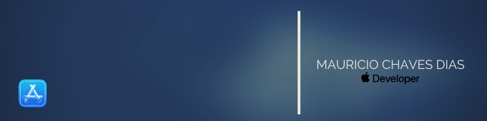
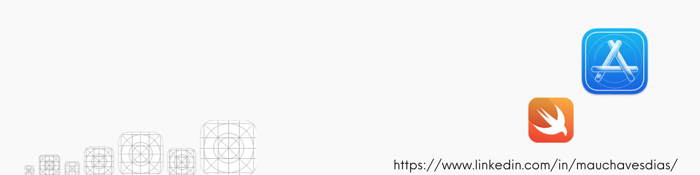

# Dicee-App

This app was built during the course "Complete iOS App Development Bootcamp" from Appbrewery by Angela Yu. 

## Description

You can make the die roll at the press of a button or by shaking your phone. With this app in your pocket, you’ll be fully set up to settle any score on the go!

## Screenshot

   

## What I learned with this app

* How to clone an existing Xcode project from GitHub.
* Create an app with behaviour and functionality.
* Create links between the Interface Builder files and code using IBActions and IBOutlets.
* Get familiar with the Xcode code editor.
* Learn to use comments to annotate code.
* Understand and use Swift constants and variables.
* Understand and use collection types such as Swift arrays.
* Test and debug your app with the Xcode console.
* Learn about randomisation and how to generate random numbers in Swift.

>This is a companion project to The App Brewery's Complete App Development Bootcamp, check out the full course at [www.appbrewery.co](https://www.appbrewery.co/)

